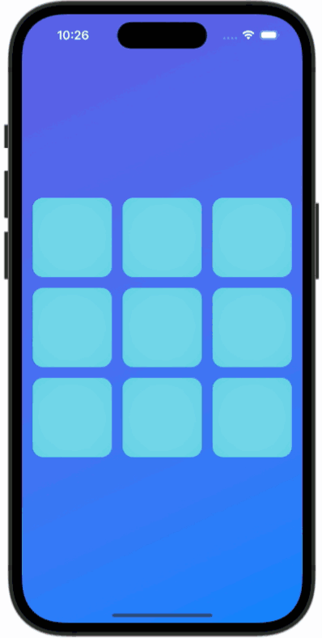

# Tic Tac Toe
Classic Tic Tac Toe game built in SwiftUI using a MVVM design pattern. AI is designed to be beatable but to also make moves based on both the current and future states of the game.

# Screenshot

